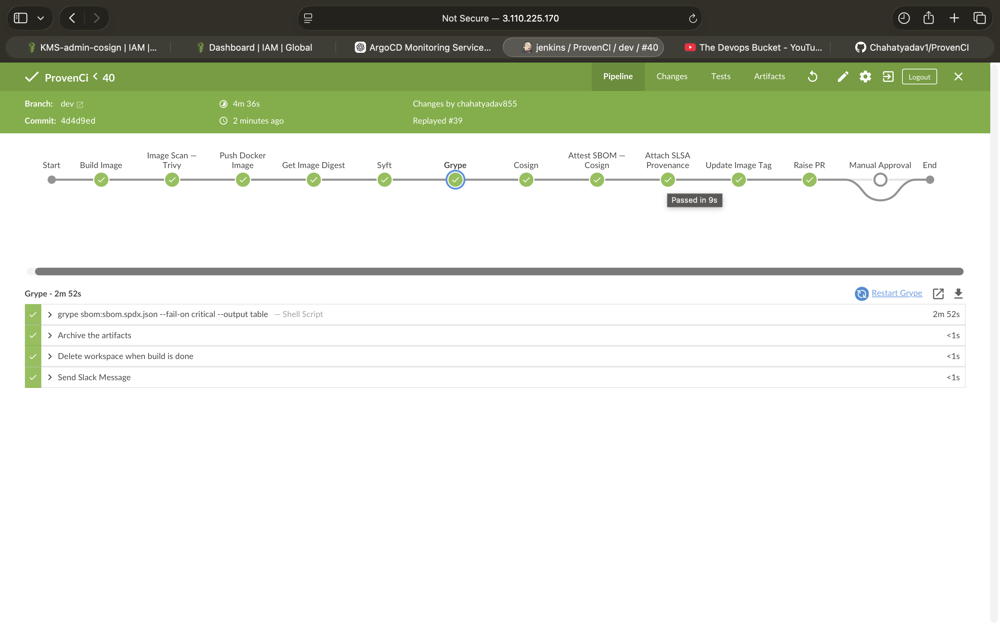
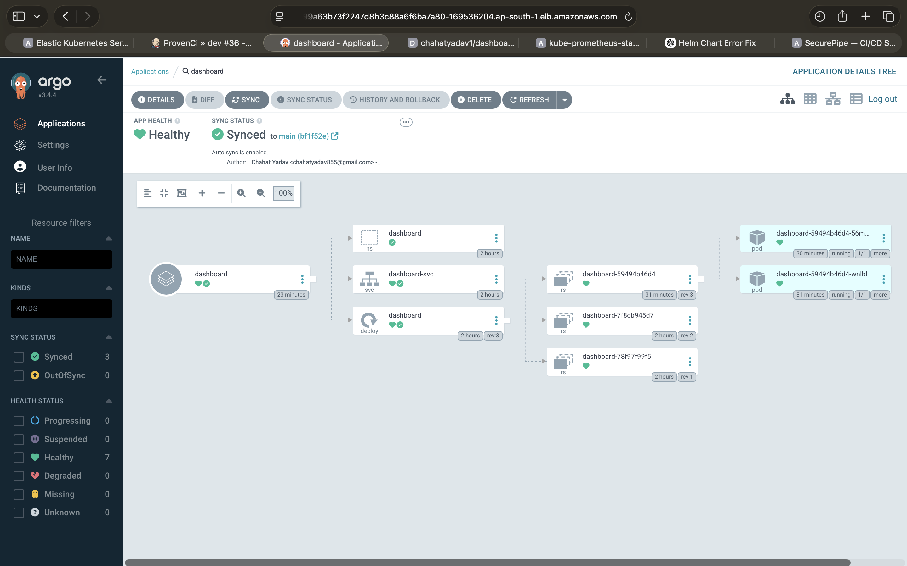
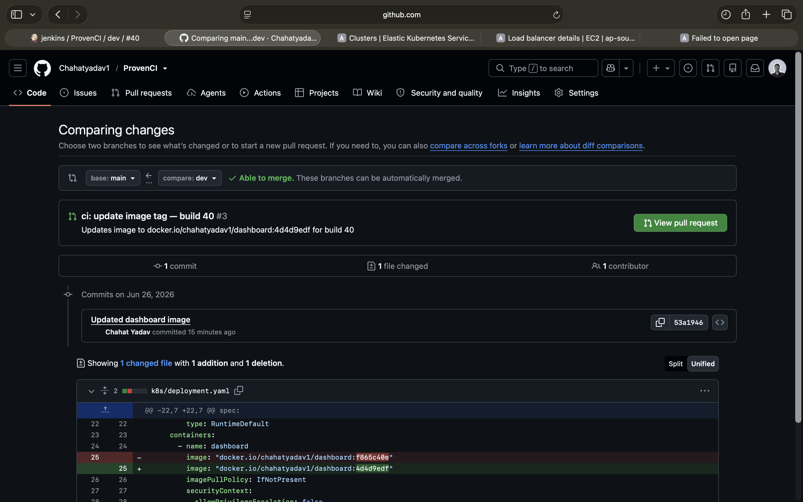
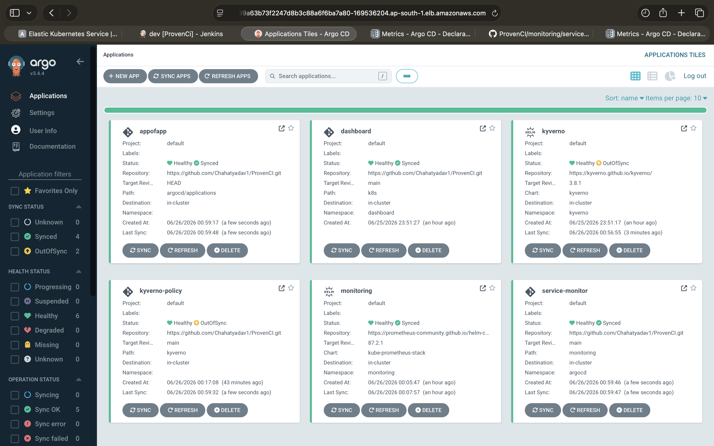
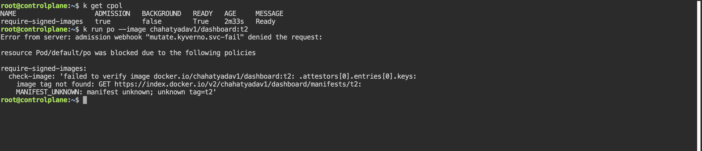
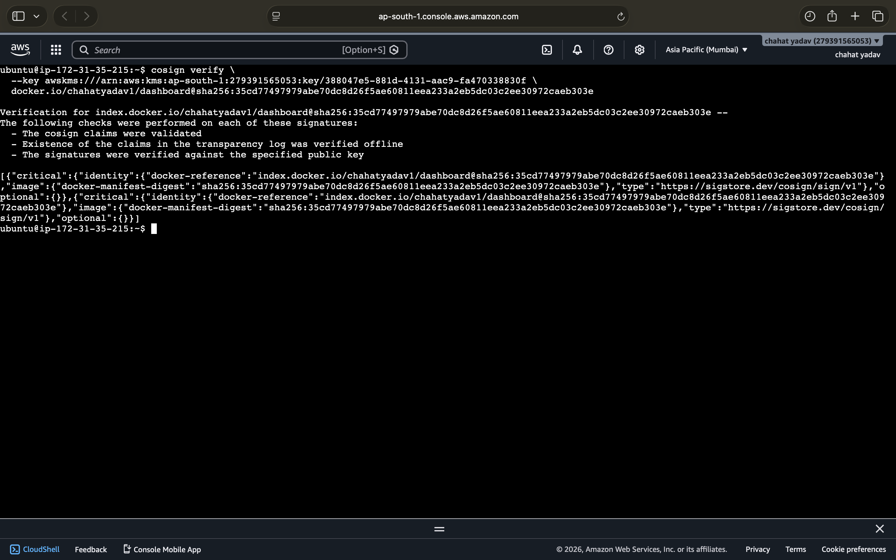
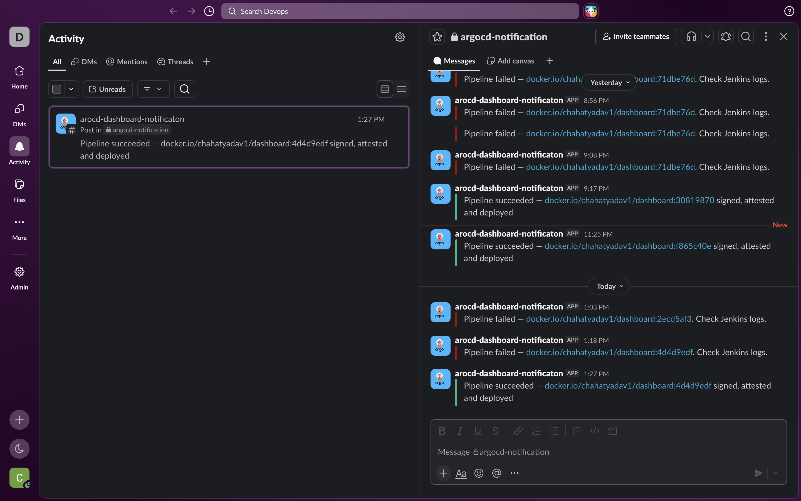
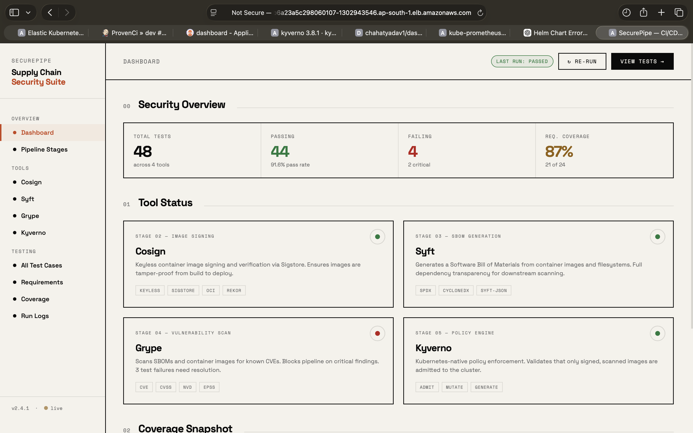

<div align="center">

# 🔐 ProvenCI

### A Production-Grade, Supply-Chain-Secure CI/CD Pipeline on AWS

[](https://www.jenkins.io/)
[](https://aws.amazon.com/eks/)
[](https://argoproj.github.io/cd/)
[](https://kyverno.io/)
[](https://docs.sigstore.dev/cosign/overview/)
[](https://aws.amazon.com/)
[](https://trivy.dev/)
[](https://slsa.dev/)
[](https://slack.com/)

> **ProvenCI** is a battle-hardened, zero-trust CI/CD pipeline that proves every artifact's integrity — from source code commit to live Kubernetes workload. Every image is scanned, signed with AWS KMS, attested with an SBOM, and accompanied by SLSA provenance before ArgoCD is ever allowed to deploy it.


</div>
---
# 📸 Project Screenshots

## Jenkins Pipeline



---

## ArgoCD Applications



---
## Raise PR


## ArgoCD Application Tree



---

## Kyverno Policy Enforcement



---

## Successful Image Verification



---
## Slack Deployment Notification



---

## Running Application



---

## 📋 Table of Contents

- [Architecture](#-architecture)
- [Infrastructure — AWS](#-infrastructure--aws)
- [CI Pipeline — Jenkins on EC2 + EKS Agents](#-ci-pipeline--jenkins-on-ec2--eks-agents)
- [Pipeline Stages](#-pipeline-stages)
- [Security Best Practices — Kubernetes](#-security-best-practices--kubernetes)
- [Kyverno Policy Enforcement](#-kyverno-policy-enforcement)
- [CD & GitOps — ArgoCD App of Apps](#-cd--gitops--argocd-app-of-apps)
- [Monitoring — Prometheus & Grafana](#-monitoring--prometheus--grafana)
- [Slack Notifications](#-slack-notifications)
- [Repository Structure](#-repository-structure)
- [Prerequisites](#-prerequisites)
- [Getting Started](#-getting-started)
- [Credentials Reference](#-credentials-reference)

---

## 🏗️ Architecture

```
  ┌─────────────────────────────────────────────────────────────────────────────┐
  │                              AWS Cloud                                      │
  │                                                                             │
  │   ┌─────────────────┐         ┌──────────────────────────────────────────┐ │
  │   │   EC2 Instance  │         │           Amazon EKS Cluster             │ │
  │   │                 │         │                                          │ │
  │   │  ┌───────────┐  │  gRPC   │  ┌────────┐  ┌────────┐  ┌──────────┐  │ │
  │   │  │  Jenkins  │◄─┼─────────┼──│ Agent  │  │ Agent  │  │  Agent   │  │ │
  │   │  │  Server   │  │  Cloud  │  │  Pod   │  │  Pod   │  │   Pod    │  │ │
  │   │  └───────────┘  │         │  │(docker │  │(trivy/ │  │(cosign/  │  │ │
  │   │                 │         │  │ +crane)│  │syft/   │  │git/grype)│  │ │
  │   └─────────────────┘         │  └────────┘  │grype)  │  └────────┘  │ │
  │          │                    │               └────────┘               │  │
  │          │ SCM Poll           │                                        │  │
  │          ▼                    │  ┌──────────┐  ┌──────────┐           │  │
  │   ┌─────────────────┐         │  │  ArgoCD  │  │Prometheus│           │  │
  │   │    GitHub       │         │  │ (GitOps) │  │+Grafana  │           │  │
  │   │  (ProvenCI.git) │         │  └──────────┘  └──────────┘           │  │
  │   └────────┬────────┘         │                                        │  │
  │            │ GitOps Sync      │  ┌──────────┐  ┌──────────┐           │  │
  │            └──────────────────┼──►  Kyverno │  │Dashboard │           │  │
  │                               │  │(Policies)│  │   App    │           │  │
  │   ┌─────────────────┐         │  └──────────┘  └──────────┘           │  │
  │   │    AWS KMS      │─────────┼─► Cosign Signing Key                  │  │
  │   └─────────────────┘         └──────────────────────────────────────────┘ │
  └─────────────────────────────────────────────────────────────────────────────┘
              │
              ▼
       ┌─────────────┐      ┌─────────────┐      ┌───────────────┐
       │  Docker Hub │      │   Slack     │      │  Sigstore     │
       │  Registry   │      │  #argocd-   │      │  (Rekor TLog) │
       └─────────────┘      │notification │      └───────────────┘
                            └─────────────┘
```

### End-to-End Flow

```
  Developer Push (dev branch)
        │
        ▼
  ┌──────────────┐    ┌──────────────┐    ┌──────────────┐    ┌──────────────┐
  │ 1. Build     │───►│ 2. Trivy     │───►│ 3. Push to   │───►│ 4. Get       │
  │    Docker    │    │    Scan      │    │    DockerHub  │    │    Digest    │
  │    Image     │    │ HIGH+CRIT    │    │              │    │  (immutable) │
  └──────────────┘    └──────────────┘    └──────────────┘    └──────────────┘
        │
        ▼
  ┌──────────────┐    ┌──────────────┐    ┌──────────────┐    ┌──────────────┐
  │ 5. Syft      │───►│ 6. Grype     │───►│ 7. Cosign    │───►│ 8. Attest    │
  │    SBOM      │    │    SBOM      │    │    Sign      │    │    SBOM      │
  │ (SPDX-2.3)   │    │    Scan      │    │  (AWS KMS)   │    │  (AWS KMS)   │
  └──────────────┘    └──────────────┘    └──────────────┘    └──────────────┘
        │
        ▼
  ┌──────────────┐    ┌──────────────┐    ┌──────────────┐    ┌──────────────┐
  │ 9. SLSA      │───►│ 10. Update   │───►│ 11. Raise    │───►│ 12. Manual   │
  │    Provenance│    │     Image    │    │     PR       │    │    Approval  │
  │  Attestation │    │     Tag      │    │  (dev→main)  │    │ (main branch)│
  └──────────────┘    └──────────────┘    └──────────────┘    └──────────────┘
        │
        ▼
  ArgoCD detects main branch change → Kyverno validates signature + SBOM → Deploy ✅
```

---

## ☁️ Infrastructure — AWS

| Component | Service | Purpose |
|-----------|---------|---------|
| **Jenkins Server** | **EC2** | Hosts the Jenkins controller; polls GitHub for SCM changes |
| **Build Agents** | **EKS (Pod Templates)** | Ephemeral Kubernetes pods spin up per build; each tool runs in its own container |
| **Signing Key** | **AWS KMS** | Asymmetric key used by Cosign to sign images and attest artifacts |
| **Kubernetes Cluster** | **EKS** | Hosts all workloads: ArgoCD, Kyverno, monitoring stack, and the dashboard app |
| **Pod Identity** | **EKS Pod Identity / IRSA** | Grants the `pod-identity` service account IAM access to KMS — no long-lived credentials |

### Why EC2 for Jenkins + EKS for Agents?

Running the Jenkins **controller** on EC2 keeps its persistent state (configs, credentials, build history) outside the cluster, avoiding the complexity of stateful Kubernetes deployments. The **agents** run as ephemeral EKS pods — they spin up on demand, run one build, and are destroyed. This gives you:

- 🔒 **Isolation**: each build gets a clean environment
- 📈 **Scalability**: agent pods scale to zero when idle
- 🧩 **Flexibility**: each pipeline stage uses its own purpose-built container image
- 💰 **Cost efficiency**: no always-on VMs consuming resources between builds

---

## 🔧 CI Pipeline — Jenkins on EC2 + EKS Agents

Jenkins connects to the EKS cluster via the **Kubernetes Cloud plugin** (`eks-cloud`). Each build spins up a multi-container pod defined in `jenkins/pod-template.yaml`. The pod template uses **pinned image digests** for every tool container — this prevents supply-chain attacks against the build toolchain itself.

### Agent Pod Containers

| Container | Image | Role |
|-----------|-------|------|
| `docker` | `docker:28-dind` | Docker-in-Docker for image builds |
| `crane` | `gcr.io/go-containerregistry/crane` | Resolves image digest post-push |
| `trivy` | `aquasec/trivy:0.71.2` | Container vulnerability scanner |
| `syft` | `alpine:3.19` + Syft v1.45.1 | SBOM generator (SPDX-2.3) |
| `grype` | `alpine:3.19` + Grype v0.114.0 | SBOM vulnerability scanner |
| `cosign` | `alpine:3.22` + Cosign v2.4.1 | Image signing & attestation |
| `git` | `alpine/git:v2.54.0` | Git ops + GitHub CLI (`gh`) + `yq` |

> 🔒 **Security note:** All base images in `pod-template.yaml` are pinned by **SHA256 digest** — not just a tag — so a compromised upstream image push cannot silently replace your build toolchain.

A gated `input` step on the `main` branch pauses the pipeline for human confirmation before the run is marked successful — acting as a final checkpoint after ArgoCD deploys.

---

## 🛡️ Security Best Practices — Kubernetes

All security hardening is applied at **multiple layers**: the Namespace, the Pod spec, and the container level.

### Namespace-Level — Pod Security Standards

```yaml
# k8s/namespace.yaml
metadata:
  labels:
    pod-security.kubernetes.io/enforce: restricted
    pod-security.kubernetes.io/audit: restricted
```

The `dashboard` namespace enforces the **`restricted`** Pod Security Standard — the strictest built-in Kubernetes profile. This blocks pods that attempt to run as root, request host-level access, or use unsafe volume types, at the API server level before any admission webhook even runs.

---

### Pod-Level Security Context

```yaml
# k8s/deployment.yaml
spec:
  automountServiceAccountToken: false   #  No cluster API access for the app
  securityContext:
    runAsNonRoot: true                  #  Pod cannot run as root
    seccompProfile:
      type: RuntimeDefault              #  Syscall filtering via seccomp
```

| Setting | Value | Why It Matters |
|---------|-------|----------------|
| `automountServiceAccountToken` | `false` | Prevents the container from accessing the Kubernetes API — unnecessary attack surface eliminated |
| `runAsNonRoot` | `true` | Enforces non-root execution at the pod scheduler level |
| `seccompProfile.type` | `RuntimeDefault` | Applies the container runtime's default syscall allowlist, blocking dangerous syscalls like `ptrace` |

---

### Container-Level Security Context

```yaml
securityContext:
  allowPrivilegeEscalation: false   #  Cannot gain more privileges than parent process
  capabilities:
    drop:
      - ALL                         #  Zero Linux capabilities
```

| Setting | Value | Why It Matters |
|---------|-------|----------------|
| `allowPrivilegeEscalation` | `false` | Prevents `setuid` / `setgid` binaries from elevating privileges |
| `capabilities.drop` | `ALL` | Strips every Linux capability (NET_RAW, SYS_ADMIN, etc.) — minimal attack surface |

---

### Base Image Choice

```dockerfile
FROM nginxinc/nginx-unprivileged:alpine3.23
```

- **Non-privileged nginx**: runs on port `8080` as a non-root user — no `setcap` tricks needed
- **Alpine base**: minimal OS footprint reduces the CVE attack surface dramatically
- **Official nginxinc image**: maintained by NGINX Inc., not a community fork

---

### Resource Limits

```yaml
resources:
  requests:
    cpu: 100m
    memory: 128Mi
  limits:
    cpu: 250m
    memory: 256Mi
```

Every container defines both `requests` and `limits`, preventing noisy-neighbour resource exhaustion and making the workload eligible for the Kubernetes scheduler's Quality of Service guarantees (`Burstable` tier).


Separate `readiness` and `liveness` probes ensure the pod only receives traffic when truly ready, and is automatically restarted if it becomes unhealthy — without human intervention.

---

## 🔏 Kyverno Policy Enforcement

Kyverno is deployed via ArgoCD and runs as a **Kubernetes admission controller**. It enforces two `ClusterPolicy` rules at pod admission time — meaning no container can start unless it passes both checks.

### Policy 1 — Require Signed Images

```yaml
# kyverno/require-signed-images.yaml
kind: ClusterPolicy
metadata:
  name: require-signed-images
spec:
  webhookConfiguration:
    failurePolicy: Fail         #  If Kyverno is down, admission is BLOCKED (fail-closed)
    timeoutSeconds: 30
  background: false             #  Only evaluates at admission, not retroactively
  rules:
    - name: check-image
      verifyImages:
        - imageReferences:
            - 'docker.io/chahatyadav1/dashboard*'
          failureAction: Enforce
          attestors:
            - entries:
                - keys:
                    publicKeys: |
                      -----BEGIN PUBLIC KEY-----
                      ... (KMS-derived ECDSA P-256 key) ...
                      -----END PUBLIC KEY-----
```

**What this does:** Any pod referencing a `dashboard` image must carry a valid Cosign signature matching the KMS public key. A pod with an unsigned image — or one signed with a different key — is **rejected at the API server**.

> 🔒 `failurePolicy: Fail` means the policy is **fail-closed**: if Kyverno's webhook is unreachable for any reason, pods are blocked rather than allowed through unchecked.

---

### Policy 2 — Require SBOM Attestation

```yaml
# kyverno/require-sbom-attestation.yaml
kind: ClusterPolicy
metadata:
  name: require-sbom-attestation
spec:
  rules:
    - name: verify-sbom-attestation
      verifyImages:
        - imageReferences:
            - "docker.io/chahatyadav1/dashboard*"
          attestations:
            - predicateType: https://spdx.dev/Document
              conditions:
                - all:
                    - key: "{{ spdxVersion }}"
                      operator: Equals
                      value: "SPDX-2.3"      # Must be exactly SPDX 2.3
```

**What this does:** Beyond just checking for a signature, this policy verifies that the image carries a **cosign-attested SBOM** with `spdxVersion: SPDX-2.3`. Images without a valid, signed SBOM attestation are blocked.

---

### Policy Exception — System Namespaces

```yaml
# kyverno/policy-exception-system-namespaces.yaml
kind: PolicyException
metadata:
  namespace: kyverno
spec:
  exceptions:
    - policyName: require-signed-images
      ruleNames: [check-image]
    - policyName: require-sbom-attestation
      ruleNames: [verify-sbom-attestation]
  match:
    any:
      - resources:
          namespaces:
            - kube-system
            - kyverno
            - monitoring
            - argocd
```

System and infrastructure namespaces are **explicitly exempted** via a `PolicyException` — a Kyverno-native mechanism that avoids disabling policies globally just to allow trusted system workloads.

---

### Kyverno Deployment via ArgoCD (Sync Waves)

Kyverno's ArgoCD applications use **sync waves** to enforce a strict deployment order:

| Wave | Application | Why First? |
|------|-------------|-----------|
| `0` | `monitoring` | Observability stack first |
| `1` | `kyverno` | Policy engine installed before any app workload |
| `2` | `kyverno-policy` | Policies applied only after Kyverno is healthy |
| `2` | `service-monitor` | ServiceMonitor CRDs available after monitoring wave |
| `3` | `dashboard` | Application deployed last — after policies are enforced |

---

## 🔄 CD & GitOps — ArgoCD App of Apps

ProvenCI uses the **App of Apps** pattern: a single root ArgoCD `Application` (`appofapp`) points to the `argocd/applications/` directory. ArgoCD then manages all child applications declaratively from Git.

```
argocd/
├── appofapp.yaml                    ← Root application (bootstrap this once)
└── applications/
    ├── kyverno-app.yaml             ← Installs Kyverno (Helm chart 3.8.1)
    ├── kyverno-policy-app.yaml      ← Applies policies from kyverno/
    ├── monitoring.yaml              ← kube-prometheus-stack (Helm 87.2.1)
    ├── service-monitorapp.yaml      ← ServiceMonitors for ArgoCD metrics
    └── application.yaml             ← Dashboard app from k8s/
```

All child applications have:
- `automated.selfHeal: true` — drift is corrected automatically
- `automated.prune: true` — deleted manifests are removed from the cluster
- `ServerSideApply: true` — uses Kubernetes SSA for safer field ownership

### Bootstrap

```bash
kubectl apply -f argocd/appofapp.yaml
```

That single command causes ArgoCD to discover and reconcile all child applications in the correct wave order.

---

### Access

All three Prometheus stack services are exposed via `LoadBalancer` (AWS ELB):

```yaml
grafana:
  service:
    type: LoadBalancer

prometheus:
  service:
    type: LoadBalancer

alertmanager:
  service:
    type: LoadBalancer
```

The **`sbom.spdx.json`** and **`provenance.json`** files are archived as Jenkins build artifacts on every run for compliance and audit trail purposes. `cleanWs()` ensures no secrets or build artifacts linger on the agent pod between runs.

---

## 📁 Repository Structure

```
ProvenCI/
├── Dockerfile                          # Non-root nginx:alpine image
├── Jenkinsfile                         # Full 12-stage pipeline definition
│
├── app/
│   └── dashboard.html                  # SecurePipe CI/CD monitoring dashboard
│
├── k8s/
│   ├── namespace.yaml                  # Namespace with restricted PSS labels
│   ├── deployment.yaml                 # Hardened Deployment (non-root, no caps)
│   └── service.yaml                    # LoadBalancer Service
│
├── kyverno/
│   ├── require-signed-images.yaml      # ClusterPolicy: enforce Cosign signature
│   ├── require-sbom-attestation.yaml   # ClusterPolicy: enforce SPDX-2.3 SBOM
│   └── policy-exception-system-namespaces.yaml  # PolicyException for infra NS
│
├── argocd/
│   ├── appofapp.yaml                   # Bootstrap: root App of Apps
│   └── applications/
│       ├── kyverno-app.yaml            # Kyverno Helm (wave 1)
│       ├── kyverno-policy-app.yaml     # Kyverno policies (wave 2)
│       ├── monitoring.yaml             # kube-prometheus-stack (wave 0)
│       ├── service-monitorapp.yaml     # ArgoCD ServiceMonitors (wave 2)
│       └── application.yaml            # Dashboard app (wave 3)
│
├── jenkins/
│   └── pod-template.yaml               # EKS agent pod: 7 tool containers
│
└── monitoring/
    ├── values.yaml                     # Prometheus stack Helm overrides
    └── service-monitor.yaml            # 6 ServiceMonitors for ArgoCD
```

---

## ✅ Prerequisites

| Tool | Version | Purpose |
|------|---------|---------|
| AWS CLI | ≥ 2.x | EKS cluster & KMS access |
| `kubectl` | ≥ 1.28 | Kubernetes cluster management |
| `helm` | ≥ 3.x | Chart deployments |
| `argocd` CLI | ≥ 2.x | ArgoCD management |
| Jenkins | ≥ 2.440 | CI server on EC2 |
| GitHub account | — | SCM + GitHub CLI for PRs |
| Docker Hub account | — | Image registry |

### Required Jenkins Plugins

- **Kubernetes** — EKS cloud agent support
- **Slack Notification** — `slackSend` step
- **Pipeline** — Declarative pipeline syntax
- **Credentials Binding** — Secure credential injection


## 🤝 Contributing

1. Fork the repository
2. Create a feature branch off `dev`
3. Open a PR against `dev` — the pipeline will validate your changes automatically

---

## 📄 License

This project is open-source. See [LICENSE](LICENSE) for details.

---

<div align="center">

**Built with security-first principles on AWS**

`EC2` · `EKS` · `KMS` · `Jenkins` · `ArgoCD` · `Kyverno` · `Cosign` · `Trivy` · `Syft` · `Grype` · `SLSA` · `Prometheus` · `Slack`

</div>
